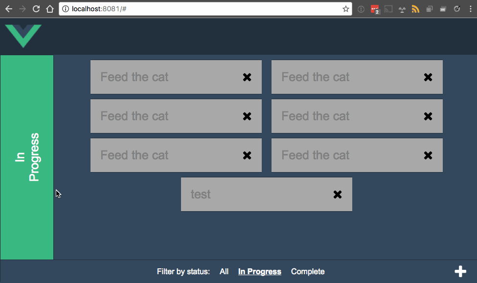

# vue-todo-client

> A todo crud js client



## Wireframe

This UI is based on [the wireframes found here](https://drive.google.com/file/d/0Bxhfk2Nciu7jT250ZzRBbTRaLW8/view?usp=sharing). 
Note that you need google drive to view this document. 

## Build Setup

``` bash
# install dependencies
npm install

# serve with hot reload at localhost:8080
npm run dev

# build for production with minification
npm run build
```

For detailed explanation on how things work, consult the [docs for vue-loader](http://vuejs.github.io/vue-loader).
